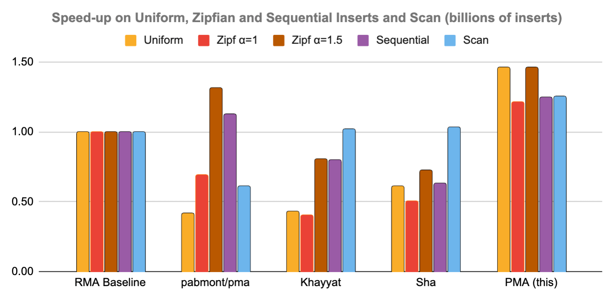

# Packed Memory Array (PMA)

**PMA** is a header-only, STL-like C++ container that maintains a **sorted, dynamically growable array** in a contiguous memory region.  
By keeping *gaps* throughout the array and controlling their density, PMA offers flexibility for updates and range scan. 

## Features

* Cache‑efficient range scans – sequential memory access
* Amortized O(log² n) insertions & deletions
* O(log n) searches via binary search
* O(1) random access by index
* ‍Fast iteration - contiguous layout beats pointer‑heavy trees
* Header‑only & STL‑like interface (aiming for drop‑in std::map replacement)

This repository is based on Rewired Memory Array [(RMA)](https://github.com/cwida/rma) implementation with segment search optimization [(SPMA)](https://itshelenxu.github.io/files/papers/spma-alenex-23.pdf).

## PMA in a nutshell

A PMA is a simple sorted array with gaps between elements. 
Unlike a traditional array, inserting a new element doesn't need more memory allocation, you simply slide elements until a gap is available.
If no gap is available *where order is preserved*, a local region is *redistributed* to reopen space. More space is allocated once the array is full or near-full.

The clever part is *how the gaps are managed*.  The array is treated as the leaves of an implicit tree; each subtree has upper and lower *density thresholds*.  When a subtree’s density leaves its allowed range, we rebalance that subtree—often touching only a small part of the PMA.

## Quick example

```cpp
#include "pma.hpp"

pma<int> v;
v.insert(10);
v.insert(5);
v.insert(20);

for (int x : v) std::cout << x << ' ';   // prints: 5 10 20

```

## Benchmark

The figure shows throughput (ops/s, higher is better) for random using sequential, random and Zipfian distributions. The current benchmark is between this repository and other existing PMA implementations. I will the results comparing `std::map` soon.



## Build

```
mkdir build && cd build
cmake ..  # or cmake -DCMAKE_BUILD_TYPE=Debug ..
make
./build/bin/experiment
```
